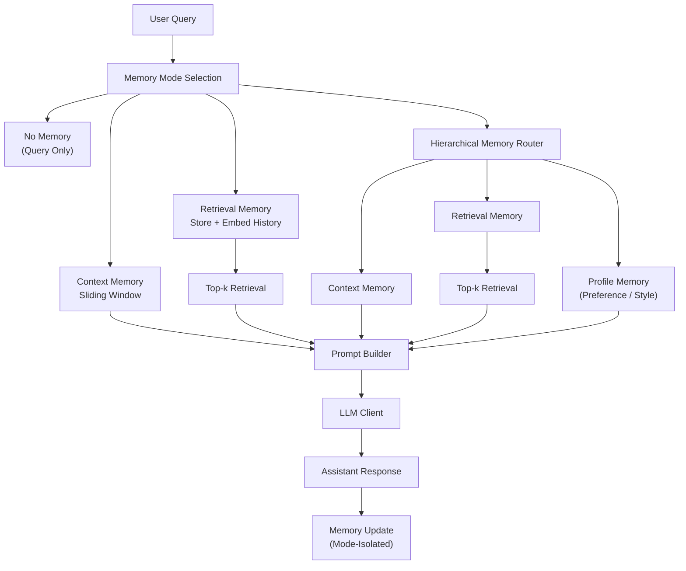

```mermaid
flowchart TB
  %% ===== Left pipeline =====
  U["User Query"]
  M["Memory Mode Selection"]

  NM["No Memory\n(Query Only)"]
  C["Context Memory\nSliding Window"]
  R["Retrieval Memory\nStore + Embed History"]
  TK["Top-k Retrieval"]

  PB["Prompt Builder"]
  LLM["LLM Client"]
  OUT["Assistant Response"]
  UPD["Memory Update\n(Mode-Isolated)"]

  %% Left flow
  U --> M
  M --> NM
  M --> C
  M --> R
  R --> TK
  C --> PB
  TK --> PB
  PB --> LLM --> OUT --> UPD

  %% ===== Right hierarchical branch =====
  HR["Hierarchical Memory Router"]

  HC["Context Memory"]
  HRM["Retrieval Memory"]
  HP["Profile Memory\n(Preference / Style)"]
  HTK["Top-k Retrieval"]

  %% Right flow
  M --> HR
  HR --> HC
  HR --> HRM
  HR --> HP
  HRM --> HTK

  %% Controlled merge
  HC --> PB
  HTK --> PB
  HP --> PB

```